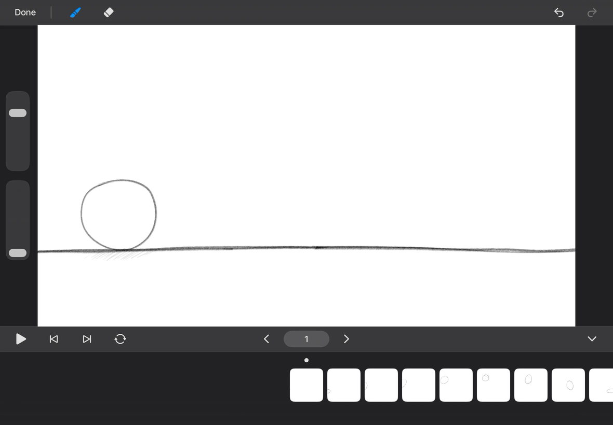

# LuxAnimate

A frame-by-frame animation app for iPad and Apple Pencil.

## How to Animate

1. Create a new project.
2. Add a scene in the Project Editor, then tap to open it.
3. Add a layer in the Scene Editor. Tap it to begin animating.
4. Draw your first frame.
5. Move to a new frame position.
6. Tap the plus button to add a new frame, and draw again.
6. Scroll across the timeline to preview your animation.

 
 

